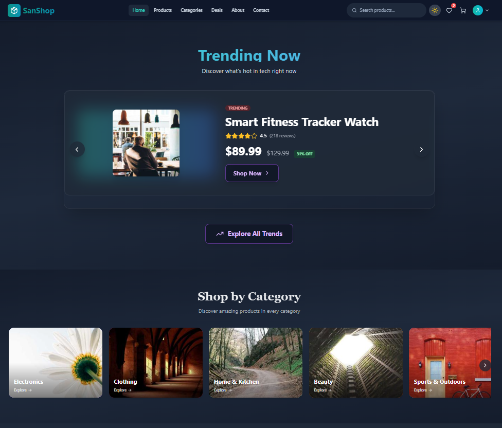
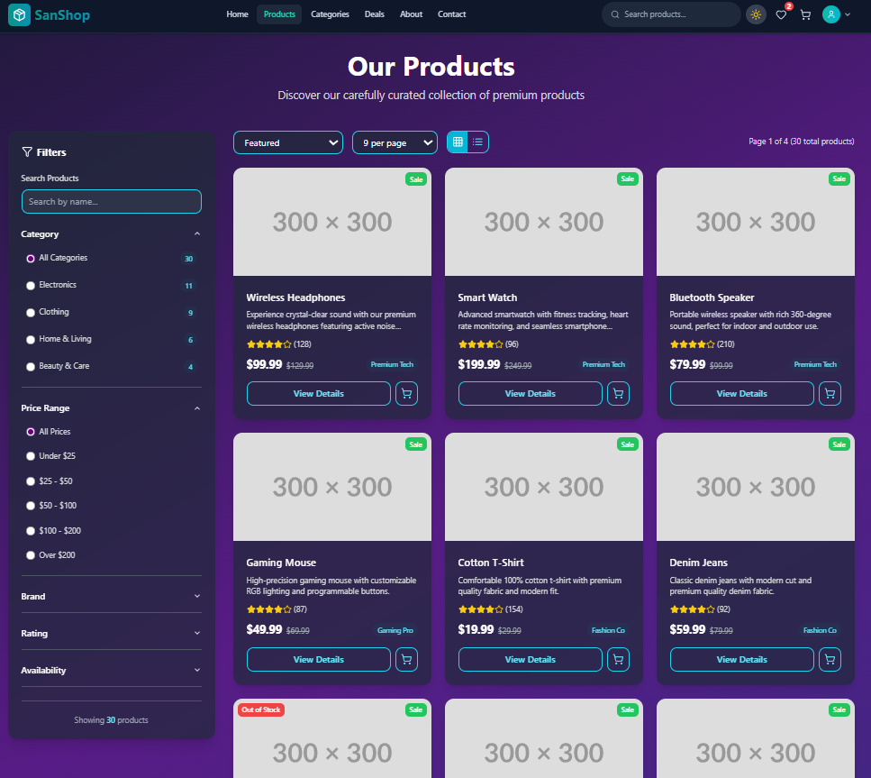
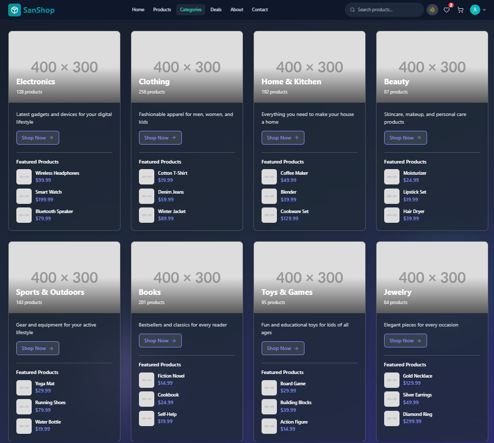
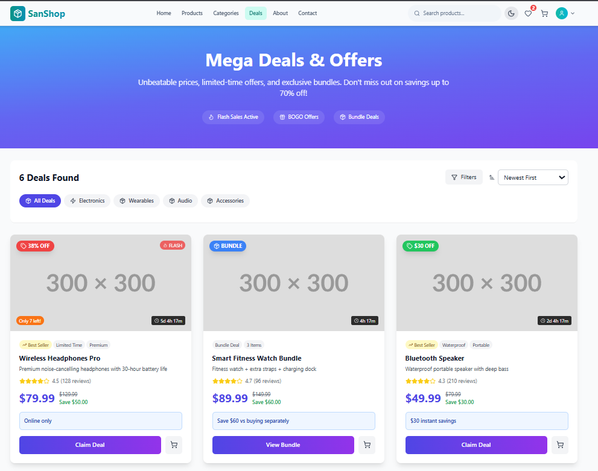
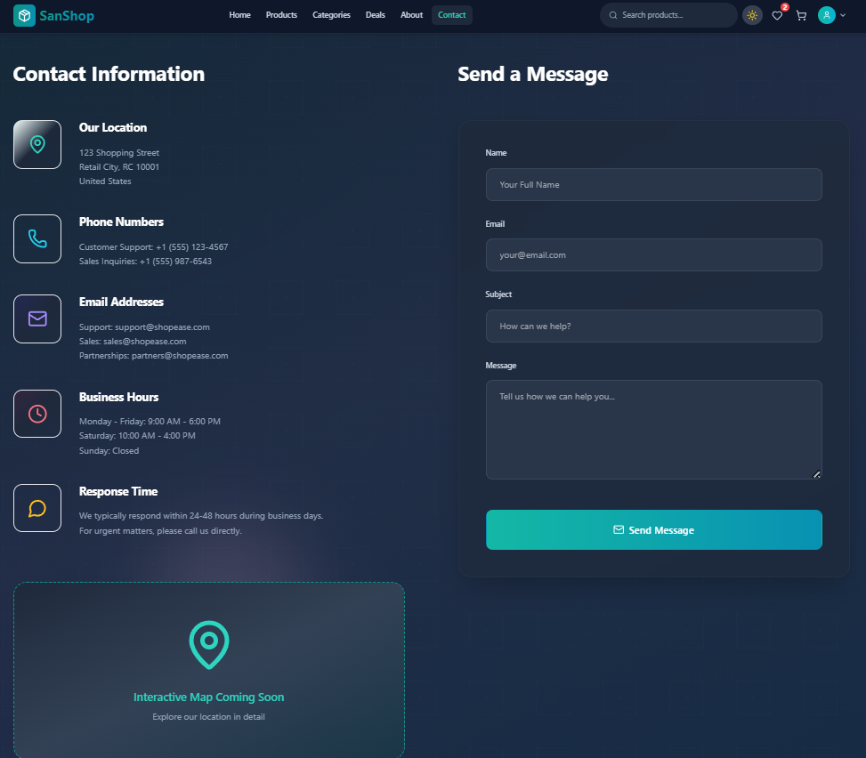
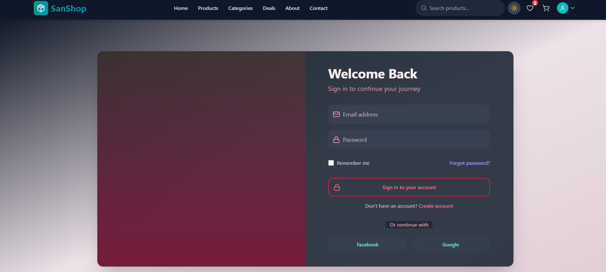
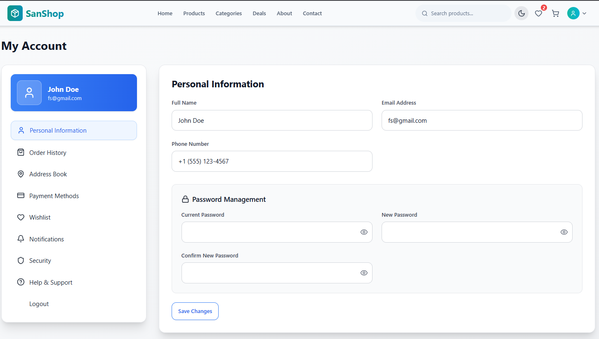

# 🛍️ SanShop - Modern E-Commerce Platform

  
  
  
  
  
  

---

## ✨ Features

### 🛒 Core E-Commerce Functionality
- **Product Catalog** - Browse through a wide variety of products with advanced filtering
- **Shopping Cart** - Add, remove, and update product quantities seamlessly
- **User Authentication** - Secure login and registration system
- **Order Management** - Track orders and view order history
- **Product Search** - Find products quickly with intelligent search

### 🎨 User Experience
- **Responsive Design** - Perfect experience across all devices (mobile, tablet, desktop)
- **Dark/Light Mode** - Toggle between themes for comfortable viewing
- **Fast Performance** - Lightning-fast page loads with Vite's HMR
- **Smooth Animations** - Elegant transitions and micro-interactions
- **Intuitive Navigation** - Easy-to-use interface with React Router DOM
- **Real-time Updates** - Instant cart and wishlist updates

### 🔧 Technical Features
- **Component-Based Architecture** - Reusable React components
- **Modern Styling** - Utility-first CSS with Tailwind
- **Icon System** - Beautiful icons with Lucide React
- **Code Splitting** - Optimized bundle sizes for faster loading
- **SEO Optimized** - Meta tags and structured data for better search visibility
- **Accessibility** - WCAG compliant for inclusive user experience

## 🚀 Quick Start

### Prerequisites

Before you begin, ensure you have the following installed:
- **Node.js** (v16.0.0 or higher)
- **npm** or **yarn** package manager
- **Git** for version control

### Installation

1. **Clone the repository**
   
   git clone https://github.com/yourusername/sanshop.git
   cd sanshop
   

2. **Install dependencies**
   
   npm install
   # or
   yarn install
   

4. **Start the development server**
 
   npm run dev
   # or
   yarn dev
 

5. **Open your browser**
   Navigate to [http://localhost:5173](http://localhost:5173)

## 🛠️ Tech Stack

### Frontend Framework
- **[React.js](https://reactjs.org/)** - A JavaScript library for building user interfaces
- **[React Router DOM](https://reactrouter.com/)** - Declarative routing for React applications

### Styling & UI
- **[Tailwind CSS](https://tailwindcss.com/)** - Utility-first CSS framework
- **[Lucide React](https://lucide.dev/)** - Beautiful & consistent icon pack

### Build Tool
- **[Vite](https://vitejs.dev/)** - Next generation frontend tooling

## 📱 Screenshots

## 🤝 Contributing

We welcome contributions! Please follow these steps:

1. Fork the repository
2. Create your feature branch (`git checkout -b feature/AmazingFeature`)
3. Commit your changes (`git commit -m 'Add some AmazingFeature'`)
4. Push to the branch (`git push origin feature/AmazingFeature`)
5. Open a Pull Request

## 🌟 Show Your Support

Give a ⭐️ if you like this project!
